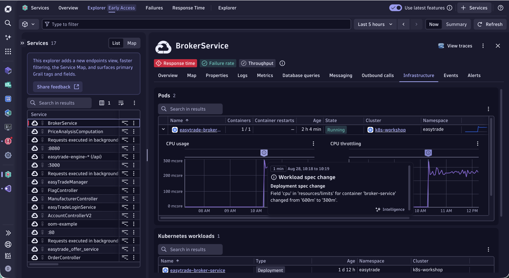
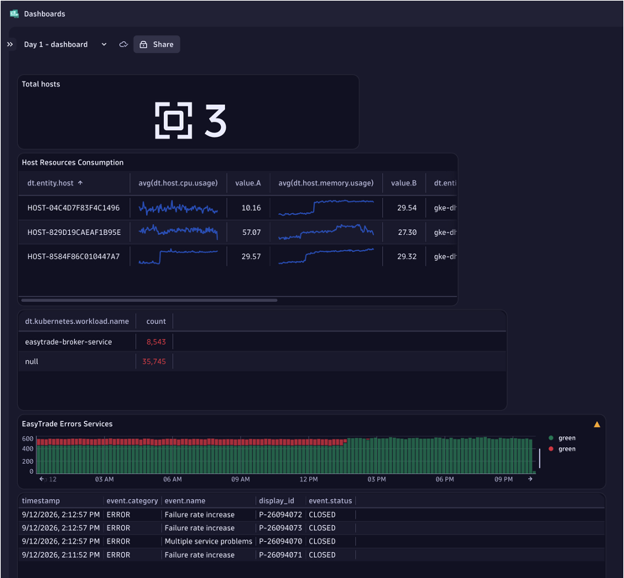

<!-- markdownlint-disable-next-line -->
#  Dynatrace Observability Workshop — EasyTrade

[](https://www.dynatrace.com)
[](https://github.com/Dynatrace/easytrade)
[](https://kubernetes.io)
[](LICENSE)

---

A hands-on observability workshop built around [EasyTrade](https://github.com/Dynatrace/easytrade), a realistic polyglot microservices trading application. You will deploy EasyTrade on Kubernetes, instrument it with Dynatrace OneAgent, and work through three real-world failure scenarios to learn how Dynatrace detects, diagnoses, and explains production problems.

<p align="center">
  
</p>

---

## What you will learn

- Deploy the **Dynatrace Kubernetes Operator** and instrument a cluster with **CloudNative FullStack** monitoring
- Explore **EasyTrade microservices** observability — topology, services, pods, distributed traces, and logs
- Perform **root-cause analysis** using distributed traces, service maps, and database query analytics
- See how **Davis AI** automatically detects anomalies, correlates impacted services, and produces a causal explanation
- Build **DQL dashboards** in Dynatrace Grail for infrastructure and application health

---

## Application architecture

EasyTrade is a polyglot microservices application that simulates a financial trading platform, deployed entirely on Kubernetes and monitored end-to-end by Dynatrace OneAgent.

```
Browser
  └─► Nginx Proxy
         ├─► React Frontend
         └─► BrokerService (.NET)
                  ├─► Engine (Java)       ──► MSSQL
                  ├─► Manager (Java)      ──► MSSQL
                  ├─► PricingService      ──► RabbitMQ
                  ├─► OfferService
                  ├─► LoginService (.NET)
                  ├─► AccountService (Go)
                  └─► FlagController (flagd)
```

---

## How Dynatrace ingests data

Dynatrace **OneAgent** is deployed as a DaemonSet on every Kubernetes node and auto-instruments each container without any code changes.

```
OneAgent (DaemonSet on each node)
  │
  ├── Topology discovery    ──► Smartscape / Entity Model
  ├── Distributed traces    ──► PurePath / Grail Trace store
  ├── Metrics               ──► Grail Metrics store
  ├── Logs                  ──► Grail Log store
  └── Business events       ──► Grail BizEvents store
                                        │
                              Dynatrace SaaS Tenant
                              (Notebooks, Dashboards,
                               Davis AI, DQL)
```

---

## Workshop structure

This workshop is designed to be completed in **2–3 hours**, following the steps in order.

| # | Section | What you do |
|---|---------|-------------|
| 0 | [Pre-requisites](docs/pre-requisites.md) | Verify GitHub Codespaces, Kubernetes cluster, and Dynatrace tenant |
| 1 | [Dynatrace Operator & OneAgent](docs/setup-dynatrace.md) | Deploy the operator and connect the cluster to Dynatrace |
| 2 | [EasyTrade Installation](docs/setup-easytrade.md) | Deploy all EasyTrade services and verify the application |
| 3 | [Platform Walkthrough](docs/platform-walkthrough.md) | Explore services, topology, traces, and logs in Dynatrace |
| 4 | [Use Case 1 — DB Not Responding](docs/usecase1-db-not-responding.md) | Inject a SQL failure; trace it from Nginx to the database |
| 5 | [Use Case 2 — High CPU Usage](docs/usecase2-high-cpu.md) | Inject CPU pressure; correlate infrastructure metrics with app degradation |
| 6 | [Use Case 3 — Dashboarding](docs/usecase3-dashboarding.md) | Build a Day 1 operations dashboard with DQL and AI prompts |
| 7 | [Cleanup](docs/cleanup.md) | Remove all workshop resources from the cluster |

---

## Pre-requisites

- **GitHub account** with Codespaces credit (or any CNCF-certified Kubernetes distribution with **4 vCPU / 16 GB RAM** per node)
- **Dynatrace SaaS tenant** — [start a 15-day free trial](https://www.dynatrace.com/trial/)
- Two API tokens created in your tenant (**Apps > Access tokens**):

| Token | Template |
|-------|----------|
| `DT_OPERATOR_TOKEN` | `Kubernetes: Dynatrace Operator` |
| `DT_INGEST_TOKEN` | `Kubernetes: Data ingest` |

---

## Use cases

### Use Case 1 — DB Not Responding

**Scenario:** Users experience failures during sell operations. Logs are scattered, errors appear across multiple services.

**What you will do:** Enable the `db_not_responding` feature flag, watch Dynatrace detect cascading failures across three services, and use Davis AI to identify the exact SQL constraint violation causing the problem.


---

### Use Case 2 — High CPU Usage

**Scenario:** BrokerService response times spike dramatically. A Kubernetes resource limit change compounds the degradation.

**What you will do:** Enable the `high_cpu_usage` feature flag, observe infrastructure CPU metrics and throttling events, and see how Dynatrace correlates the Kubernetes workload spec change with the application performance degradation.



---

### Use Case 3 — Dashboarding with DQL

**Scenario:** Build a "Day 1 Dashboard" for the EasyTrade platform that gives an operations team immediate situational awareness.

**What you will do:** Create a five-tile dashboard with total host count, host resource consumption, log error counts by workload, BrokerService success vs failure rate, and recent Davis AI problems — using hand-authored DQL, metrics queries, and AI prompt-to-DQL.



---

## Documentation

The full step-by-step workshop documentation is in the [`docs/`](docs/) directory and is served as a MkDocs site.

- [Pre-requisites](docs/pre-requisites.md)
- [1. Dynatrace Operator & OneAgent](docs/setup-dynatrace.md)
- [2. EasyTrade Installation](docs/setup-easytrade.md)
- [3. Platform Walkthrough](docs/platform-walkthrough.md)
- [4. Use Case 1 — DB Not Responding](docs/usecase1-db-not-responding.md)
- [5. Use Case 2 — High CPU Usage](docs/usecase2-high-cpu.md)
- [6. Use Case 3 — Dashboarding](docs/usecase3-dashboarding.md)
- [Cleanup](docs/cleanup.md)
