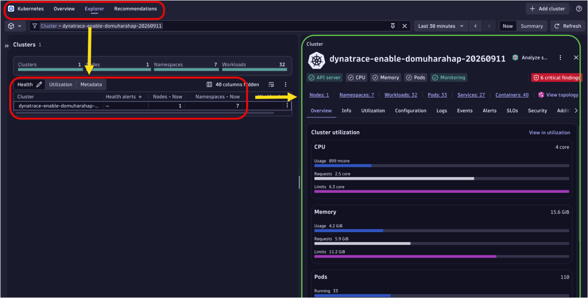
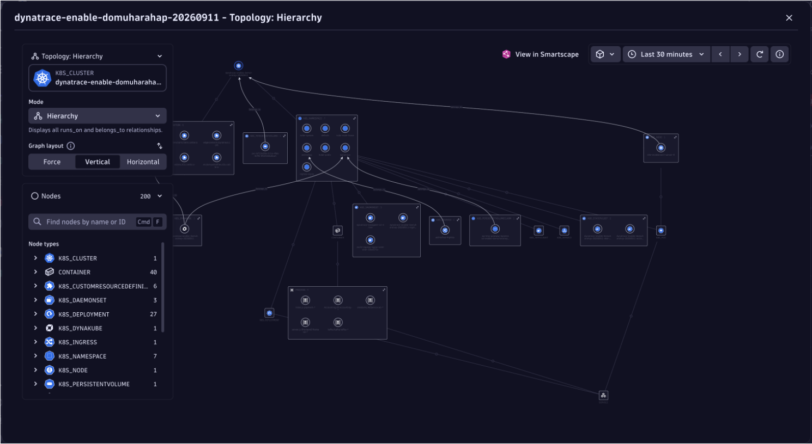
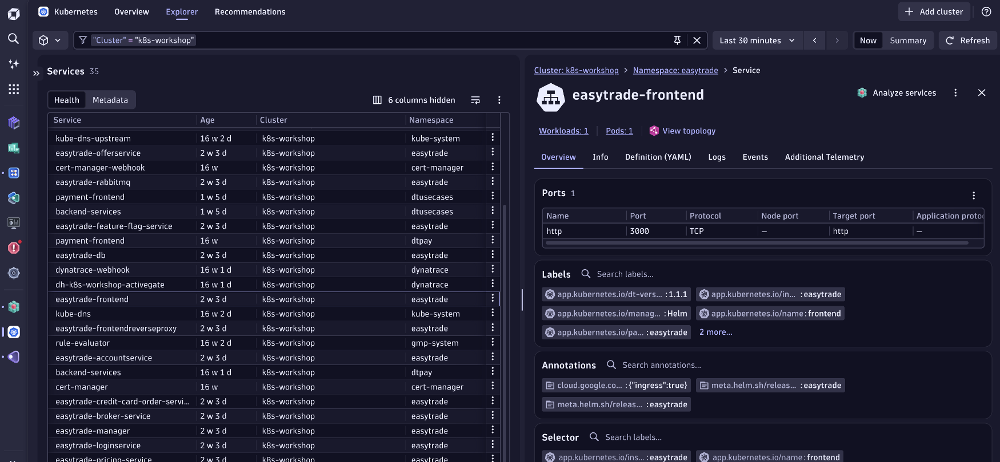
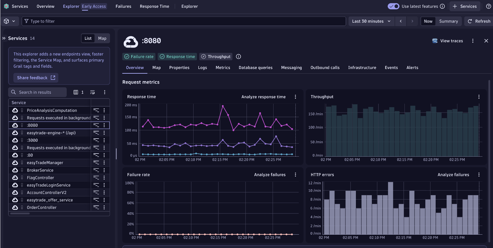
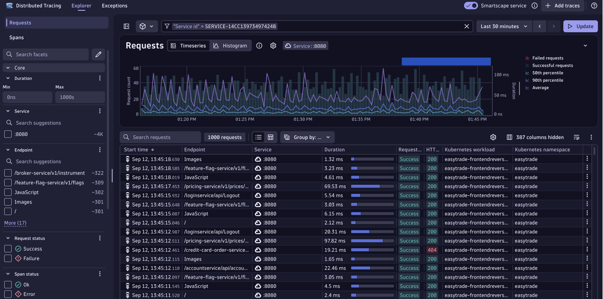

# 3. Platform Walkthrough

Before jumping into the use cases, spend a few minutes familiarising yourself with how EasyTrade appears in Dynatrace. This walkthrough covers the Kubernetes Explorer, topology view, service explorer, and distributed tracing — the four areas you will rely on throughout the use cases.

---

## Step 1 — Kubernetes Explorer

1. In your Dynatrace tenant, navigate to **Kubernetes Apps > Explorer** (left-side menu or global search).
2. Use the **Cluster** filter at the top to select your cluster.
3. The overview cards show:
    - **Nodes** — count and health
    - **Namespaces** — list of active namespaces
    - **Workloads** — Deployments, StatefulSets, DaemonSets
    - **Pods** — total and running count
    - **Containers** — total running containers
4. Click **"View topology"** (top-right) to switch to the visual topology graph.

!!! info "Cluster health indicator"
    A green cluster indicator means all nodes are `Ready` and no Kubernetes-level problems are detected by Davis AI. Yellow or red indicates node pressure, OOMKill events, or scheduling failures.

---

## Step 2 — Topology / Hierarchy view

The topology view (Smartscape) renders the full Kubernetes hierarchy. Each layer is a distinct entity type in the Dynatrace entity model:

| Layer | Entity type |
|---|---|
| Cluster | `dt.entity.kubernetes_cluster` |
| Node | `dt.entity.host` (with cloud metadata) |
| Namespace | `dt.entity.kubernetes_namespace` |
| Workload | `dt.entity.kubernetes_workload` |
| Pod | `dt.entity.kubernetes_pod` |
| Container | `dt.entity.container_group_instance` |
| Service | `dt.entity.service` (auto-detected from OneAgent) |

Click any entity to open its details panel on the right. You can navigate up and down the hierarchy by clicking parent/child links.

---

## Step 3 — Kubernetes workloads and services

1. In the Kubernetes Explorer, click the **Workloads** tab.
2. Filter by **Namespace = `easytrade`**.
3. You will see all EasyTrade Deployments listed with CPU/memory utilisation and pod counts.
4. Click **`easytrade-frontend`** to open the workload detail panel.
5. Note the **Labels** section (e.g., `app: easytrade-frontend`, `version: 1.5.x`) — Dynatrace uses these for entity naming and grouping.
6. Click **"Open in Services"** to jump directly to the auto-detected Service entity for this workload.

!!! tip "Namespace filtering"
    The namespace filter is persistent within a session. If you cannot see EasyTrade workloads, confirm the namespace filter is set to `easytrade` and that OneAgent has been running for at least 3 minutes.

---

## Step 4 — Application services in Services Explorer

1. Navigate to **Application & Microservices > Services > Explorer** (may be listed as **Services** under the Early Access section).
2. Apply the following filters in the filter bar:
    - `k8s.cluster.name` = your cluster name
    - `k8s.namespace.name` = `easytrade`
3. The list shows all auto-detected services. Dynatrace creates one service entity per process group (one per container type).
4. Click **BrokerService** in the list.
5. On the service detail page, observe:
    - **Response time** chart — p50, p90, p99 over time
    - **Failure rate** chart — percentage of HTTP requests returning 4xx/5xx
    - **Throughput** chart — requests per minute
6. Click **"View traces"** (top-right of the chart area) to open the Distributed Tracing view for this service.

!!! note "Baseline values"
    Record the current (healthy) values for BrokerService:
    - Response time (p90): approximately 74 ms
    - Failure rate: approximately 0%
    - Throughput: approximately 60 requests/min

    You will compare these against the injected failure values in the use cases.

---

## Step 5 — Distributed Traces

1. In the Distributed Tracing view (opened from Step 4), filter by the BrokerService entity.
2. The top of the page shows:
    - A **Timeseries chart** of request count over time
    - A **Histogram** of response time distribution
3. The **filter rail** on the left lets you narrow by:
    - HTTP status code
    - Response time range
    - Service name
    - Trace ID or span ID
4. The **trace list** below shows individual traces, each with:
    - Start time
    - Root endpoint (e.g., `/broker-service/v1/trade/sell`)
    - Response time
    - HTTP status code
    - Number of spans
5. Click any trace to open the **waterfall view** — a full span tree showing every service call in the trace.

!!! tip "Recording a baseline"
    Before injecting any failures, note the current error rate and p90 response time shown in the timeseries. Take a screenshot if helpful. This becomes your baseline for comparing the impact of each use case.

- [4. Use Case 1 — DB Not Responding :octicons-arrow-right-24:](usecase1-db-not-responding.md)

