# 4. Use Case 1 — DB Not Responding

## Overview

!!! info "Scenario"
    Users experience failures during trade sell operations. Failures are intermittent, logs are scattered across multiple services, and multiple errors appear in distributed traces for the broker service. The support team has no immediate idea which component is causing the problem.

In this use case you will inject a database failure using a feature flag, observe how Dynatrace detects and correlates the cascading failures across three services, and use Davis AI to get a causal explanation and remediation path.

**Feature flag:** `db_not_responding`
**Root cause:** SQL exception — `Cannot insert explicit value for identity column in table 'Trades' when IDENTITY_INSERT is set to OFF`

---

## Step 1 — Inject the failure

1. Open the EasyTrade UI in your browser (`$EASYTRADE_URL`).
2. Click the **wrench icon** (🔧) in the top-right navigation bar to open the Feature Flags panel.
3. Scroll down to find **"DB not responding"** (flag ID: `db_not_responding`).
4. Click to expand the flag entry.
5. Toggle the switch to **Enabled**.
6. Click **Save**.
7. Wait **2–3 minutes** for the failure to propagate and for Dynatrace to detect the anomaly.

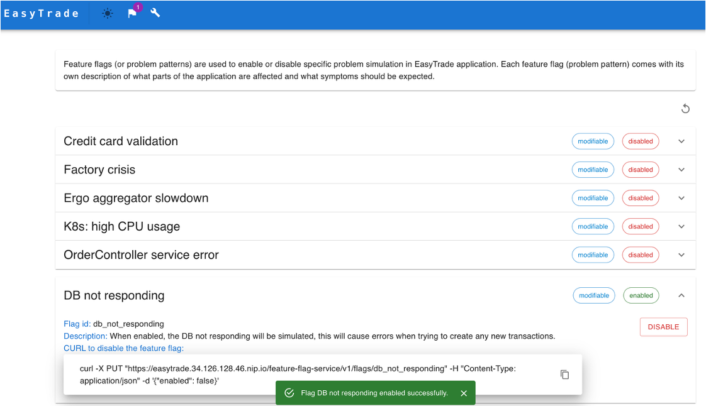

!!! tip "Alternative — curl"
    ```bash
    curl -X PUT "${EASYTRADE_URL}/feature-flag-service/v1/flags/db_not_responding" \
      -H "Content-Type: application/json" \
      -d '{"enabled": true}'
    ```

---

## Step 2 — Services view — observe the failure

1. In Dynatrace, navigate to **Application & Microservices > Services > Explorer**.
2. Filter by `k8s.namespace.name = easytrade`.
3. Select the service running on **port :8080** (the Nginx proxy / frontend entry point).
4. Observe:
    - **Failure rate** chart spiking upward (will reach 15–30%)
    - HTTP error count shown in **red** in the throughput area
    - Response time increasing

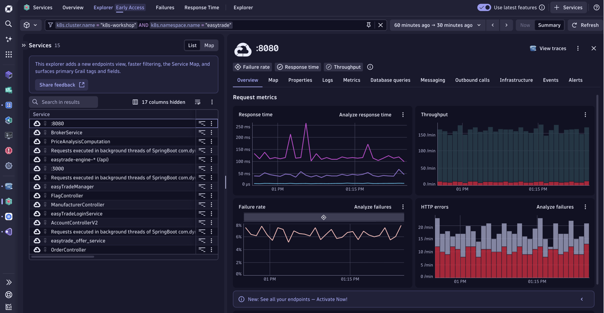

!!! note "Why :8080?"
    The :8080 service is the first service in the call chain reached by external traffic. Its failure rate is the first visible symptom from the end-user perspective.

---

## Step 3 — Service map

1. On the :8080 service detail page, click the **Map** tab.
2. The service map shows the topology of calls:
    ```
    My web application
         └─► :8080 (Nginx proxy)
                  └─► BrokerService
                           └─► TradeManagement (DB)
    ```
3. Note the **red error indicator** on the BrokerService node — this identifies it as the propagation point.

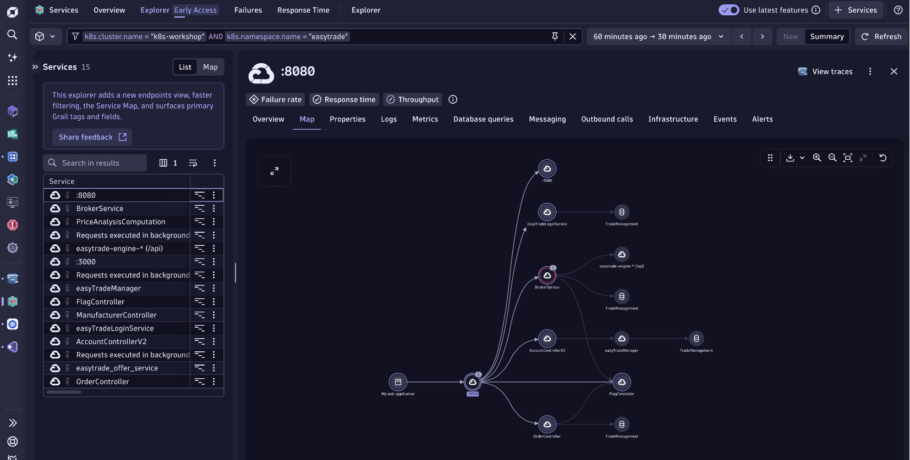

---

## Step 4 — BrokerService deep dive

1. Click **BrokerService** in the service map (or navigate back to Services > Explorer and select it).
2. Click the **Outbound calls** tab.
3. You will see **3 HTTP outbound call groups**:
    - `easytrade-engine` — trade matching
    - `easytrade-feature-flag-service` — flag evaluation
    - `easytrade-pricing-service` — pricing lookup
4. Expand each call group to see individual endpoint patterns and their error counts.

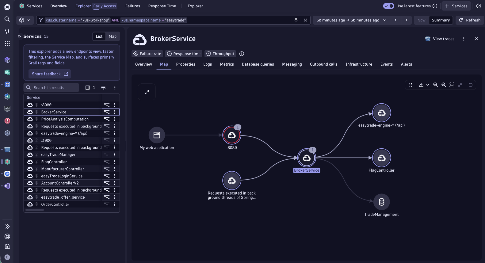

---

## Step 5 — Database queries

1. Still on BrokerService, click the **Database queries** tab.
2. A list of **20 unique SQL queries** is shown, ordered by call count or error count.
3. Find the top query — it begins with:
    ```sql
    SET IMPLICIT_TRANSACTIONS OFF;
    SET NOCOUNT ON;
    INSERT INTO ...
    ```
4. This query shows:
    - **235 errors**
    - Average response time: **3.17 ms** (fast, but always failing)
5. Click the query to see the full SQL text and the error message associated with it.

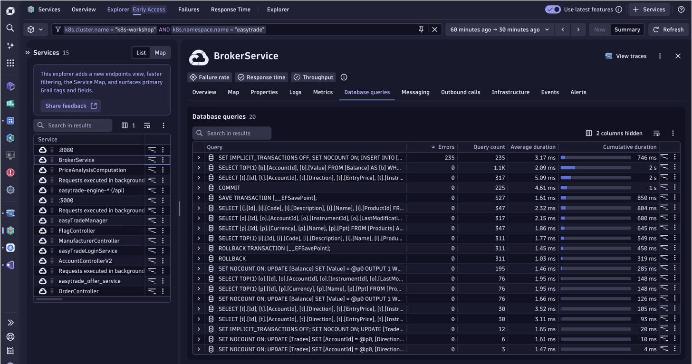

!!! warning "The clue is here"
    The `INSERT INTO` statement is failing because `IDENTITY_INSERT` is set to OFF in the database, but the application is trying to supply an explicit value for the identity column. This is the root cause.

---

## Step 6 — Alerts

1. Click the **Alerts** tab on BrokerService.
2. You will see a **"Failure rate"** alert entry with:
    - Started date and time
    - Problem ID (e.g., `P-26094070`)
3. Click **Analyze** on the alert to open the full problem context.

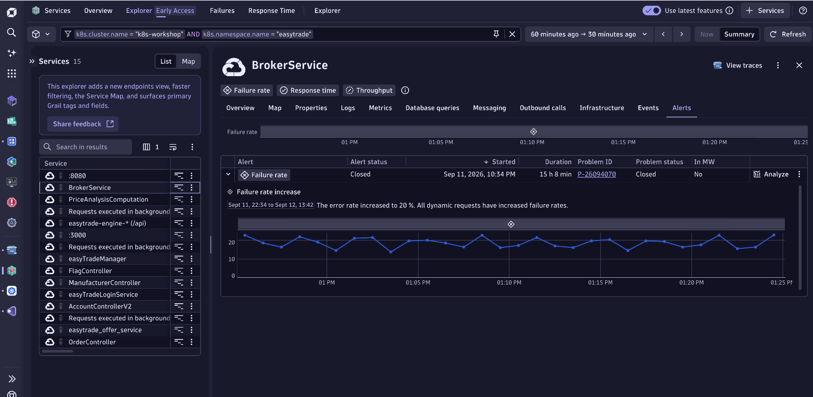

---

## Step 7 — Problem summary

1. Navigate to **Problems** (left navigation or search for the Problem ID `P-26094070`).
2. The problem card is titled **"Multiple service problems"**.
3. The **Impact** section lists three affected services:
    - **TradeManagement** — identified as root cause (error rate: 24.42%)
    - **BrokerService** — propagation point (slowdown and failure spike)
    - **:8080** — user-visible failure surface
4. The **Root cause** box highlights TradeManagement with its exact error rate percentage.

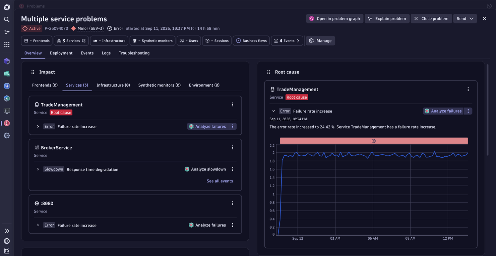

---

## Step 8 — Logs from the problem

1. Inside the problem view, click the **Logs** tab.
2. In the filter bar, select **"Show last 100 error and warning logs"**.
3. You will see a stream of `ERROR` level log entries from the `broker-service` container containing messages such as:
    ```
    Error while saving changes: An error occurred while saving the entity changes.
    ```
4. The logger source is `EasyTrade.BrokerService.BrokerDbContext` — the Entity Framework database context.

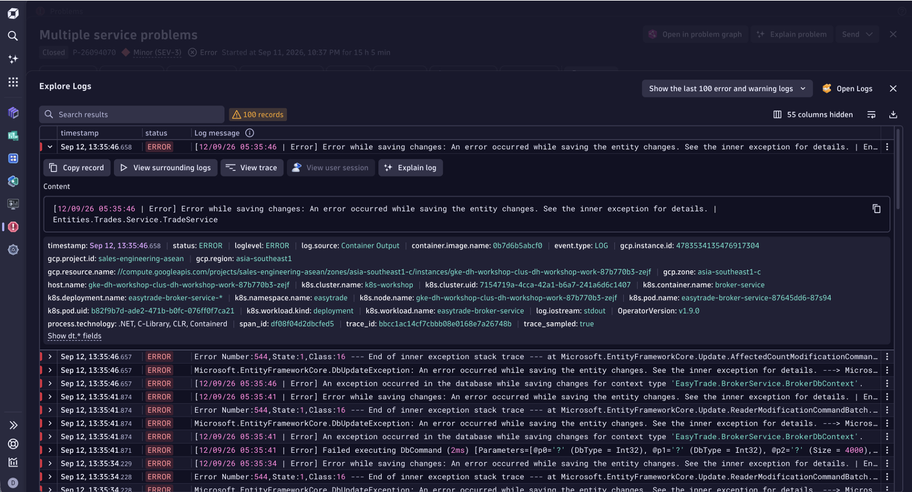

---

## Step 9 — Distributed trace view

1. Click **"View trace"** on any error log entry.
2. This opens the **Distributed Tracing waterfall** for the specific request.
3. The root span is:
    ```
    /broker-service/v1/trade/71  →  503 Service Unavailable
    ```
4. The waterfall shows the full call chain — from Nginx through BrokerService down to the SQL call.
5. Note the tabs at the top of the trace detail:
    - **7 Logs** — correlated log entries for this exact trace
    - **3 Exceptions** — unhandled exceptions captured in the spans

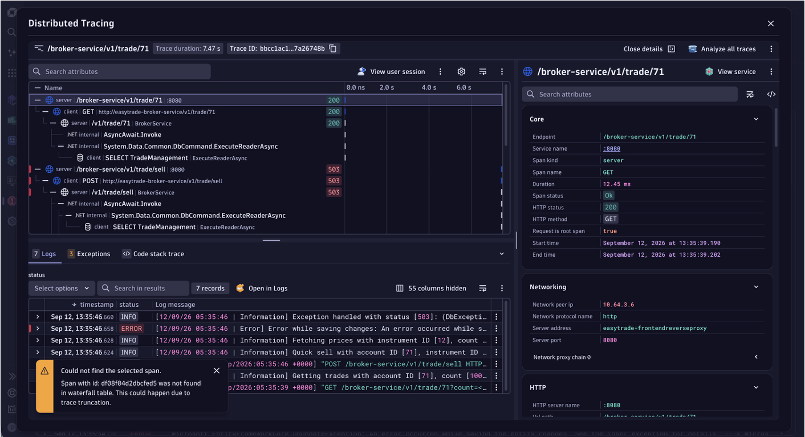

---

## Step 10 — Exceptions — root cause confirmed

1. Click the **Exceptions** tab.
2. The top exception is:
    ```
    Microsoft.Data.SqlClient.SqlException:
    Cannot insert explicit value for identity column in table 'Trades'
    when IDENTITY_INSERT is set to OFF.
    ```
3. The stack trace shows the exception originating in `EasyTrade.BrokerService.ExceptionHandling`.
4. Note the **Deployment release version** shown in the trace context: `1.5.9`.

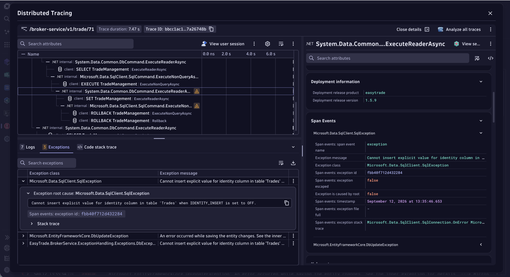

!!! tip "Why this matters"
    This exception is the definitive root cause. Without distributed tracing, a developer would only see a generic 503 at the Nginx layer and would have to correlate logs manually across multiple services. Dynatrace surfaces the exact SQL exception with its full stack trace in a single click.

---

## Step 11 — Davis AI summarization

1. Click the **"Explain problem"** button (AI icon) at the top of the problem view.
2. Davis AI runs two background agents:
    - **Root Cause Details Agent** — analyses the entity graph and anomaly sequence
    - **Troubleshooting Agent** — suggests investigation steps
3. The AI summary explains:
    - **What happened:** A cascading failure across 3 services triggered by a database-level SQL constraint violation
    - **Why:** TradeManagement reached a 24.42% error rate; BrokerService p90 response time spiked from 74 ms to 2.7 s (+3,534%)
    - **Resolution path** (visual):
        ```
        :8080  ──►  BrokerService  ──►  TradeManagement (root cause)
        ```

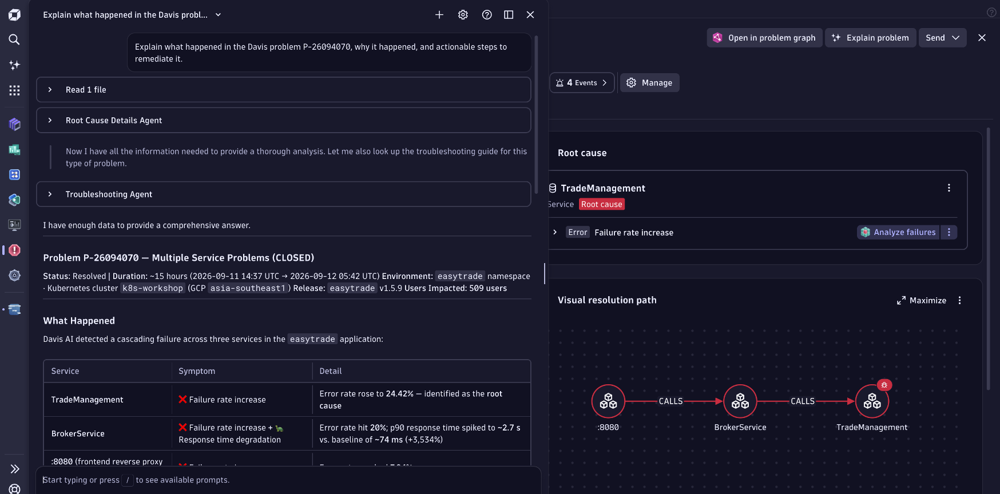

---

## Remediation

Disable the feature flag to stop the failure injection:

=== "Feature flags UI"
    Open EasyTrade > wrench icon > Feature Flags > DB not responding > toggle to **Disabled** > Save.

=== "curl"
    ```bash
    curl -X PUT "${EASYTRADE_URL}/feature-flag-service/v1/flags/db_not_responding" \
      -H "Content-Type: application/json" \
      -d '{"enabled": false}'
    ```

Wait 2–3 minutes for Dynatrace to detect recovery and close the problem automatically.

<div class="grid cards" markdown>
- [5. Use Case 2 — High CPU Usage :octicons-arrow-right-24:](usecase2-high-cpu.md)
</div>
