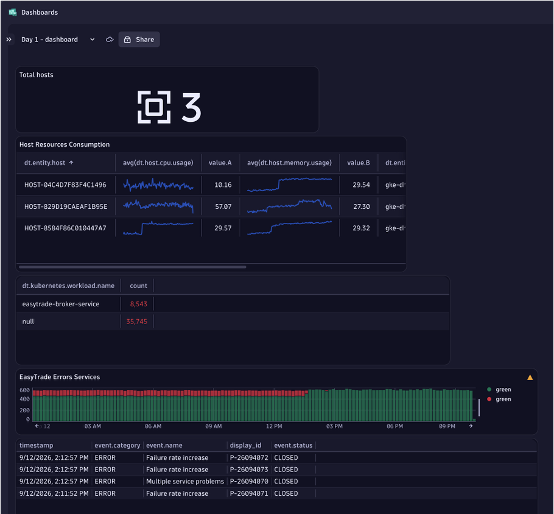

# 6. Use Case 3 — Dashboarding with DQL

## Overview

!!! info "Scenario"
    Build a "Day 1 Dashboard" for the EasyTrade platform that gives an operations team immediate situational awareness — infrastructure health, log error counts by workload, and recent problems — all powered by **Dynatrace Query Language (DQL)** and the Dashboards AI prompt-to-DQL feature.

In this use case you will create a five-tile dashboard using a mix of hand-authored DQL, metrics queries, log queries, and AI-generated prompts.



---

## Step 1 — Create a new dashboard

1. In Dynatrace, navigate to **Dashboards** (left navigation).
2. Click **"+ New dashboard"**.
3. Give it the name: **`Day 1 - dashboard`**
4. Click **Create**.

You now have an empty canvas. Each tile below is added by clicking the **+** button in the top toolbar or the canvas.

---

## Tile #1 — Total Hosts (DQL)

This tile shows the total number of monitored hosts as a single value.

### Steps

1. Click **+** > select **DQL**.
2. Set the tile title to: **`Total hosts`**
3. Enter the following DQL query:

```dql
fetch dt.entity.host
| summarize count(), alias: hosts
```

4. Click **Run**.
5. Under **Visual configuration**, select **Single value**.
6. The tile displays the number `3` (or however many hosts your cluster has).

!!! note "Entity fetch vs metrics"
    `fetch dt.entity.host` queries the entity model directly — it returns one row per discovered host entity. The `summarize count()` aggregates them into a single number.

---

## Tile #2 — Host Resource Consumption (Metrics)

This tile shows CPU and memory utilisation for each host in a table.

### Steps

1. Click **+** > select **Metrics**.
2. Set the tile title to: **`Host Resources Consumption`**
3. Configure **Source A**:
    - Metric: `dt.host.cpu.usage`
    - Aggregation: **avg**
    - Split by: `dt.entity.host`
    - Reduce to: **Last**
4. Configure **Source B**:
    - Metric: `dt.host.memory.usage`
    - Aggregation: **avg**
    - Split by: `dt.entity.host`
    - Reduce to: **Last**
5. Under **Visual configuration**, select **Table**.
6. The table shows one row per host with columns for CPU% and memory%.

!!! tip "Threshold colouring"
    In the table visual settings, you can add conditional colouring: turn CPU% red when it exceeds 80% to make high-utilisation hosts stand out immediately.

---

## Tile #3 — Log Error Count by Workload (Logs)

This tile shows which Kubernetes workloads are generating the most error logs.

### Steps

1. Click **+** > select **Logs**.
2. Set the tile title to: **`Errors per Workload`**
3. In the filter bar, add: **`status = ERROR`**
4. In the **Summarize** section:
    - Aggregation: **Count**
    - Split by: `dt.kubernetes.workload.name`
    - Limit: **20**
5. Under **Visual configuration**, select **Table**.
6. Add a threshold: if count > 0, colour the row **red**.

The table shows each EasyTrade workload alongside its error log count, making it easy to spot which service is generating the most noise.

---

## Tile #4 — BrokerService Success vs Failure (Prompt)

Use the AI prompt-to-DQL feature to build a bar chart without writing DQL manually.

### Steps

1. Click **+** > select **Prompt**.
2. Set the tile title to: **`EasyTrade Errors Services`**
3. Enter the following prompt text:

```
Display number of success request and failed request for services name "BrokerService",
display in bar chart with success request is green and failed red
```

4. Click **Run**.
5. Dynatrace generates DQL and renders a **bar chart** with two bars:
    - Green bar: successful requests (HTTP 2xx)
    - Red bar: failed requests (HTTP 4xx/5xx)
6. Review the generated DQL (click "View query" to inspect it). Adjust the visual colour mapping if needed.

!!! tip "Iterating on prompts"
    If the generated chart does not look right, refine the prompt and click Run again. You can also click "Edit query" to modify the generated DQL directly.

??? tip "Example of generated DQL"
    The AI typically generates something like:
    ```dql
    fetch spans
    | filter service.name == "BrokerService"
    | summarize
        success = countIf(http.status_code < 400),
        failed  = countIf(http.status_code >= 400)
    | fields success, failed
    ```
    The exact DQL may vary depending on your data model and Dynatrace version.

---

## Tile #5 — Recent Problems (Prompt)

Use the prompt feature to surface recent Davis AI problems directly on the dashboard.

### Steps

1. Click **+** > select **Prompt**.
2. Set the tile title to: **`Recent Problems`**
3. Enter the following prompt text:

```
Show most recent problems. Only show those records that have a display id.
Keep these fields: timestamp, display id, event name, event category and event status.
Sort by timestamp, descending.
```

4. Click **Run**.
5. The tile renders a table showing 4 records with columns:
    - `timestamp`
    - `display_id` (e.g., `P-26094070`)
    - `event.name`
    - `event.category`
    - `event.status` (e.g., `CLOSED`)

!!! info "The display_id filter"
    The instruction "only show those records that have a display id" filters out internal events that do not have a user-visible Problem ID. This ensures the table shows only actionable Davis AI problems.

---

## Saving and sharing the dashboard

1. Click **Save** (top-right).
2. To share with your team, click the **Share** button and select the appropriate visibility (personal, team, or organisation-wide).
3. The dashboard URL is persistent — you can bookmark it and return at any time.

!!! tip "Dashboard variables"
    For a production-grade dashboard, consider adding **Dashboard variables** for cluster name and namespace. This lets viewers switch between clusters without editing the tiles.

---

## Knowledge check

Try each hands-on exercise yourself first, then click the answer to expand it. Add each as a new tile on your **Day 1 - dashboard**.

### Exercise 1 — Count of problems per status

Add a DQL tile that shows how many problems exist per `event.status` (for example `ACTIVE` vs `CLOSED`) as a bar chart. Only count records that have a `display_id`, like Tile #5.

??? success "Show answer"
    1. **+** > **DQL**, title `Problems by status`.
    2. Query:
        ```dql
        fetch events
        | filter event.kind == "DAVIS_PROBLEM" and isNotNull(display_id)
        | summarize count = count(), by: {event.status}
        ```
    3. **Run**, then set **Visual configuration** to **Bar chart**.

    **Why:** `fetch events` with `event.kind == "DAVIS_PROBLEM"` returns Davis problem events. `isNotNull(display_id)` drops internal events without a user-visible Problem ID, and `summarize ... by:` groups them per status.

    The exact fields can vary with your Dynatrace version. If the query returns nothing, use the Tile #5 prompt, click **View query**, and adapt the generated DQL.

### Exercise 2 — Find the worst workload for errors in the last 2 hours

Tile #3 shows errors per workload using the Logs UI builder. Rebuild it in DQL, limited to the last 2 hours, sorted with the noisiest workload first, top 5 only. How does this help after the Use Case 1 injection?

??? success "Show answer"
    1. **+** > **DQL**, title `Top 5 error workloads (2h)`.
    2. Query:
        ```dql
        fetch logs, from: now() - 2h
        | filter loglevel == "ERROR"
        | summarize errors = count(), by: {dt.kubernetes.workload.name}
        | sort errors desc
        | limit 5
        ```
    3. **Run**, then choose **Table** or **Bar chart**.

    **Reading the result:** while `db_not_responding` is enabled, `easytrade-broker-service` should be at or near the top, matching the `EasyTrade.BrokerService.BrokerDbContext` errors from Use Case 1. The dashboard points you at the failing workload before you open a single problem.

    **Tip:** if the `loglevel` field is not populated in your environment, filter on `status == "ERROR"` as in Tile #3.

---

## Advanced — Import the Data Layer Overview Dashboard

!!! info "Going further with DQL"
    Already comfortable with the basics? Skip the manual tile setup and import a production-ready dashboard that showcases more advanced DQL patterns — multi-source joins, funnel analysis, and cross-entity correlations.

### Step 1 — Download the dashboard JSON

The dashboard is available as a pre-built JSON file in this repository:

📄 **`docs/dashboard/Simply_smarter-Data_Layer_Overview.json`**

Download or clone the file to your local machine.

### Step 2 — Upload to Dynatrace

1. In Dynatrace, navigate to **Dashboards** (left navigation).
2. Click the **"Upload"** button (or the **three-dot menu** `...` > **Upload dashboard**).
3. Select the downloaded file: `Simply_smarter-Data_Layer_Overview.json`
4. Click **Open / Upload**.

The dashboard is imported instantly and opens automatically.

!!! tip "Finding the Upload button"
    If you do not see an **Upload** button on the Dashboards list page, click the **⋮** (more options) icon in the top-right corner of the Dashboards screen — **Upload dashboard** appears in the dropdown.

### Step 3 — Explore the advanced DQL tiles

Once imported, click **Edit** on any tile to inspect the underlying DQL. Use it as a reference for:

| Pattern | What to look for |
|---------|-----------------|
| Multi-entity joins | `lookup` and `join` across entity types |
| Funnel analysis | Chained `filter` + `summarize` on spans |
| Cross-signal correlation | Combining logs, metrics, and traces in a single query |
| Conditional colouring | `threshold` rules tied to DQL field values |

<div class="grid cards" markdown>
- [Cleanup :octicons-arrow-right-24:](cleanup.md)
</div>
